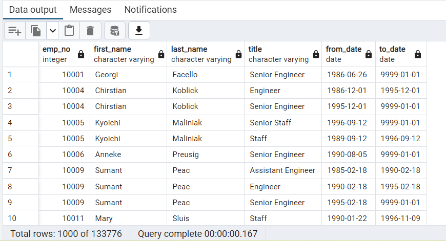
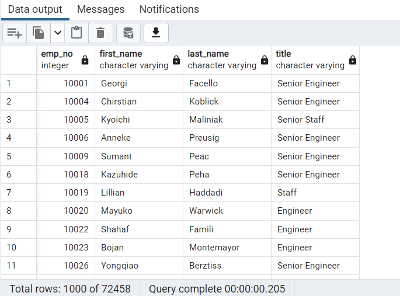
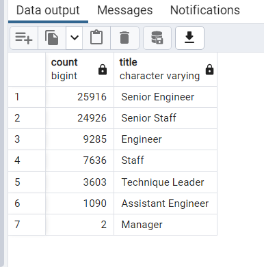
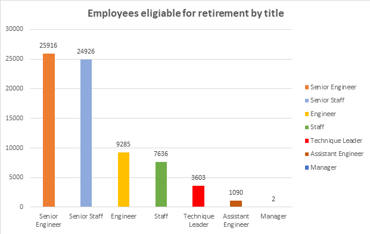
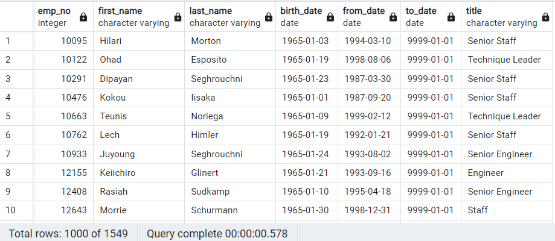
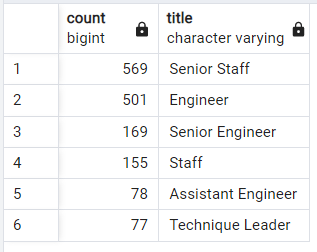
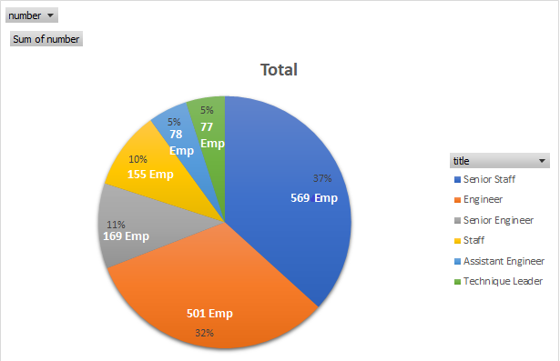
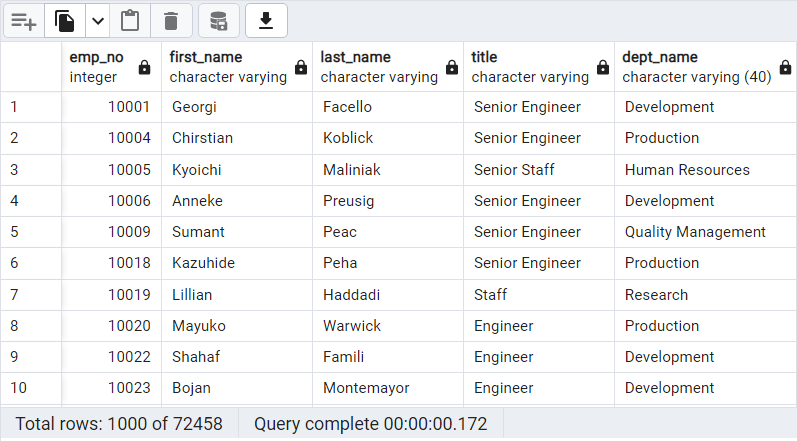
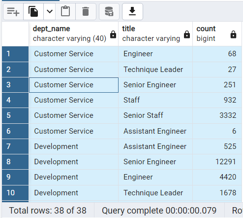
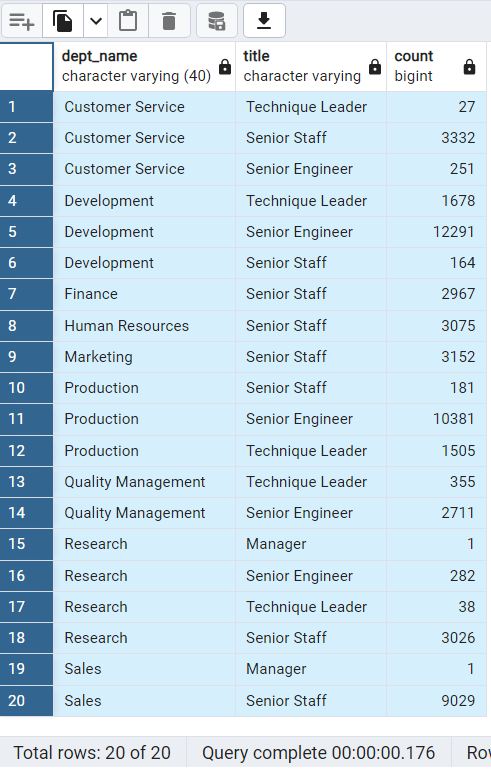

# Pewlett-Hackard-Analysis
## 1.	Overview of the analysis:
The purpose of this analysis is to prepare Pewlett-Hackard, a company with several thousand employees, for the upcoming “silver tsunami”. Many employees will begin retiring at a rapid rate in the next few years and the company wants to be prepared with the retirement packages, open positions, and employees’ training. 

## 2.	Results: :
First, we Identify the employees qualified for retiring and then insert all the Data in a temporal Table, that holds title of all current employees born between 1/1/52 and 12/31/55 and using functions by SQL like inner join we connected the different tables and make relations using the ERP diagram like a guide. Resulting of the first query retrieved a list of retiring employees but with some duplicate rows.

### Fig 1. Table(retirement_titles) of Retiring Employees by Title with duplicates.
  

Using the function in SQL “Distinct” with “Order by” to remove duplicate rows.
### Fig 2. Table(unique_titles) of Retiring Employees by unique Title.

  

The total of Retiring Employees is 72458, to know how many employees by departments I  created another query to retrieve the number of employees by their most recent job title who are about to retire and insert this data in a temporal table. 
### Fig 3. Table(retiring_titles) of total Retiring Employees by title.

 

in base of this table the title “Senior Engineer” have the highness number of Retiring employees (25916), In second place the title “Senior Staff” with 24926, and in the third place “Engineer” (9285). And we can see the another’s title raking scroll down in the table.
### Fig 4. Diagram of Retiring Employees by their most recent job title.

 

### •	The Employees Eligible for the Mentorship Program
Using the ERD, I created a mentorship-eligibility table that holds the current employees who were born between January 1, 1965, and December 31, 1965, eligible for participate  in the mentorship program. Obtained the total number of Employees Eligible for the Mentorship Program is 1549.

### Fig 5. Table(mentorship_eligibilty) of Employees Eligible for the Mentorship Program. 
 

Additional I created a query for retrieve the number of employees eligible for mentorship program by title. Obtained the raking by title.  
### Fig 6. Raking of the number of employees eligible for mentorship program by title.
 

The highness numbers of employees qualified for mentorship program comes from the title “Senior Staff” with 569 and “Engineer” with 501 employees in second place. 
### Fig 7. Percentage of employees eligible for mentorship program by title.
 

## 3.	Summary: 
•	How many roles will need to be filled as the "silver tsunami" begins to make an impact?
For answer this question I write a query for create a temporal table for add the department information for each Retiring employee.

### Fig 8. Table(unique_titles_department) of Retiring Employees by title and department. 
 
Then, the next query shows the roles will need to be filled as the "silver tsunami" begins to make an impact by department. 
### Fig 9. Table(rolls_to_fill) of roles will need to be filled by title and department. first 10 rows.
 

•	Are there enough qualified, retirement-ready employees in the departments to mentor the next generation of Pewlett Hackard employees?

The final query is for retrieved the Qualified staff who going to be ready to mentor next generation. Using a temporal table and using the following titles to filter ('Senior Engineer', 'Senior Staff', 'Technique Leader', 'Manager') to determine the employees qualified for mentor program in the future with a total of 54447 employees.
### Fig 10. Table(qualified_staff) of Qualified staff with retirement-ready to mentor next generation.
 

